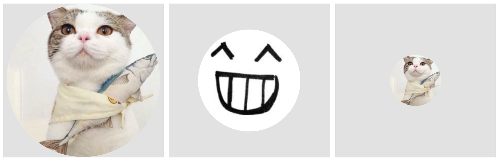

### 痛点
>不用再担心图片被挤压或者拉伸导致变形，也不用通过js动态读取图片，以宽或者高作为参考进行图片缩放，用以达到图片最全的展示出来

### 解决方法
>html5: img 属性： object-fit

### 解决效果

### 参考
>[MDN](https://developer.mozilla.org/zh-CN/docs/Web/CSS/object-fit) 
>[兼容](https://caniuse.com/#search=object-fit)
